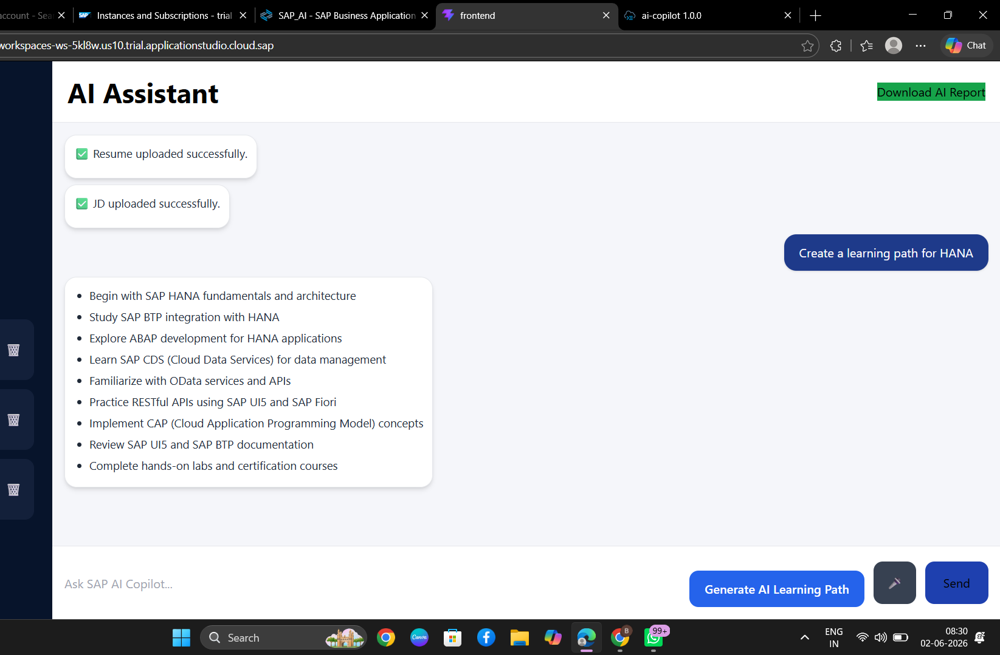
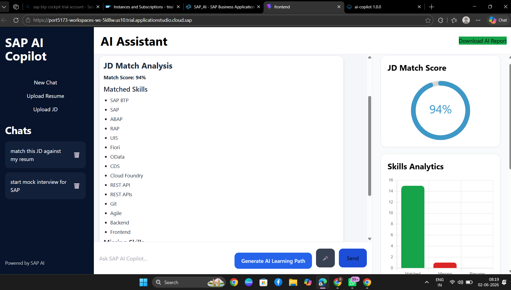
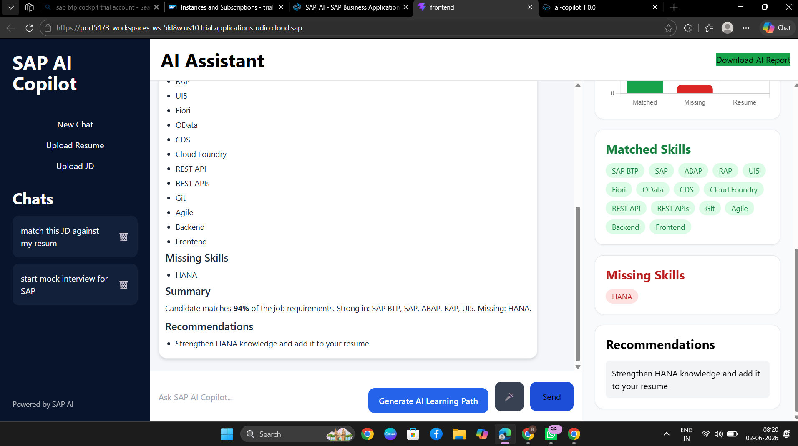
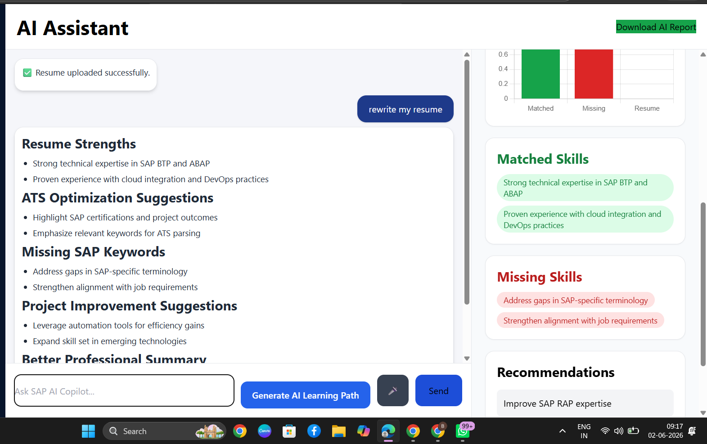
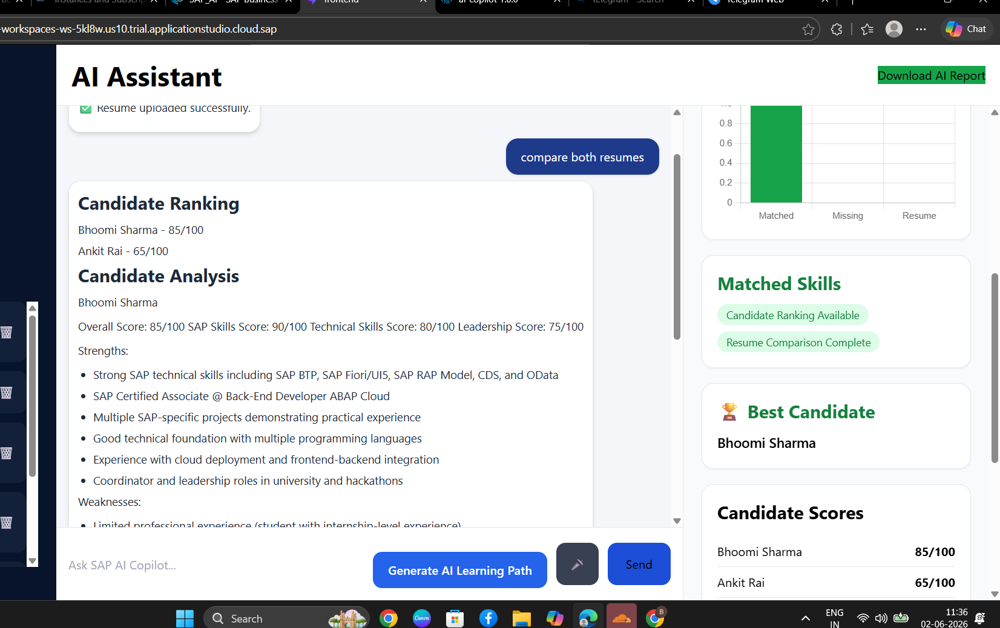
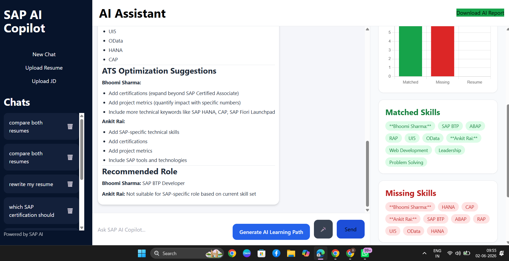

# SAP AI Copilot

## Overview

SAP AI Copilot is an AI-powered career and recruitment assistant built on SAP technologies. The application helps users analyze resumes, compare candidates, generate personalized learning paths, evaluate interview answers, recommend SAP certifications, generate reminder emails, and answer SAP-specific technical questions.

The project combines SAP CAP, SAP HANA Cloud, SAP BTP, React, and Generative AI to create a smart assistant for SAP professionals, recruiters, students, and job seekers.

---

## Features

### Resume Analysis

* Upload resume (PDF/DOC)
* Extract resume content automatically
* Resume strengths analysis
* Resume weaknesses analysis
* ATS optimization suggestions
* Missing SAP keyword detection
* Professional summary generation
* Recommended SAP role identification

### Job Description Matching

* Upload Job Description (JD)
* Compare resume against JD
* Generate JD match percentage
* Identify matched skills
* Identify missing skills
* Generate hiring probability
* Provide improvement recommendations

### Resume Rewrite Assistant

* Rewrite resume using SAP terminology
* Improve ATS compatibility
* Enhance professional summary
* Add SAP-specific keywords
* Improve project descriptions
* Generate recruiter-friendly resume content

### Resume Comparison

* Compare multiple resumes
* Candidate ranking
* Best candidate recommendation
* Candidate strengths and weaknesses
* Hiring recommendation
* Technical skill comparison
* Leadership skill comparison

### Learning Path Generator

* Analyze missing skills
* Generate personalized learning roadmap
* Recommend SAP technologies to learn
* Suggest certifications
* Career progression guidance
* SAP BTP learning path generation

### SAP Certification Recommendation

* Analyze current skills
* Recommend next SAP certification
* Certification roadmap generation
* Role-based certification suggestions

Examples:

* Which SAP certification should I take next?
* Best certification for SAP BTP Developer
* Certification roadmap for SAP Architect

### Interview Preparation Assistant

* Generate SAP interview questions
* Technical interview preparation
* Behavioral interview preparation
* SAP BTP interview questions
* ABAP interview questions
* RAP interview questions
* CAP interview questions

### Interview Answer Evaluation

* Evaluate candidate answers
* Provide feedback
* Score interview responses
* Suggest improvements
* Identify weak areas

### Reminder Email Generator

Generate professional emails for:

* Interview reminders
* Certification preparation reminders
* Job application follow-ups
* Learning progress reminders
* Professional communication

### General AI Chat

* Career guidance
* Technology recommendations
* Learning advice
* Professional development support
* SAP career planning
* Industry insights

Examples:

* How do I become a SAP BTP Architect?
* What skills are in demand in SAP?
* Create a 6-month SAP learning roadmap.

### SAP Expert Assistant

Supports technical questions related to:

* SAP BTP
* SAP HANA
* ABAP
* RAP
* CAP
* CDS
* SAPUI5
* SAP Fiori
* OData
* SAP Integration Suite
* Cloud Foundry
* SAP BAS

Examples:

* Explain SAP RAP architecture.
* Generate a CDS View example.
* How does CAP connect to HANA Cloud?
* Create a SAPUI5 table with OData binding.

### Conversational Memory

* Remember user preferences
* Remember career goals
* Store important information
* Personalized recommendations

Examples:

* Remember that I want to become a SAP BTP Architect.
* What should I learn next?

### Voice Assistant

* Speech-to-text support
* Voice-based interactions
* Ask questions using microphone input

### Analytics Dashboard

* JD Match Score
* Skills Analytics
* Matched Skills
* Missing Skills
* Recommendations
* Candidate Ranking
* Best Candidate Identification

### AI Report Download

* Download AI-generated report
* Share candidate analysis
* Export learning recommendations

---

## Technology Stack

### Frontend

* React
* TypeScript
* Tailwind CSS
* Vite
* React Markdown
* Chart.js
* Circular Progress Bar

### Backend

* SAP CAP (Cloud Application Programming Model)
* Node.js
* Express.js

### Database

* SAP HANA Cloud

### AI Integration

* OpenRouter API
* GPT Models

### SAP Services

* SAP BTP
* SAP HANA Cloud
* SAP Business Application Studio
* Cloud Foundry

---

## Architecture

User Interface (React)

↓

SAP CAP Backend

↓

AI Processing Layer

↓

OpenRouter AI

↓

SAP HANA Cloud Database

↓

Analytics & Reporting Dashboard

---

## Project Structure

ai-copilot/

├── app/

│   └── chat/

│       └── webapp/

│

├── frontend/

│   ├── src/

│   │   ├── components/

│   │   ├── lib/

│   │   ├── App.tsx

│   │   └── main.tsx

│

├── srv/

│   ├── ai.js

│   ├── upload.js

│   ├── compareResumes.js

│   ├── interview.js

│   ├── learningPath.js

│   └── server.js

│

├── db/

│   └── schema.cds

│

├── package.json

└── README.md

---

## Installation

### Clone Repository

git clone https://github.com/your-repository/sap-ai-copilot.git

cd sap-ai-copilot

### Install Backend Dependencies

npm install

### Install Frontend Dependencies

cd frontend

npm install

---

## Environment Variables

Create a .env file in the root directory.

OPENROUTER_API_KEY=your_api_key

PORT=4004

---

## Running the Application

### Start Backend

cds watch

Backend URL:

http://localhost:4004

### Start Frontend

cd frontend

npm run dev

Frontend URL:

http://localhost:5173

---

## Usage

### Resume Analysis

1. Upload Resume
2. Ask:

Analyze my resume

3. View:

* Resume Strengths
* Resume Weaknesses
* ATS Suggestions
* Recommended Role

---

### JD Matching

1. Upload Resume
2. Upload JD
3. Ask:

Match my resume against this JD

4. View:

* Match Score
* Matched Skills
* Missing Skills
* Recommendations

---

### Resume Comparison

1. Upload Resume A
2. Upload Resume B
3. Ask:

Compare both resumes

4. View:

* Candidate Ranking
* Candidate Scores
* Best Candidate
* Hiring Recommendation

---

### Learning Path Generation

Ask:

Generate SAP learning path

View:

* Learning roadmap
* Missing skills
* Certifications
* Recommended technologies

---

### Certification Recommendation

Ask:

Which SAP certification should I take next?

View:

* Recommended certification
* Learning roadmap
* Exam preparation guidance

---

### Interview Preparation

Ask:

Generate SAP BTP interview questions

or

Evaluate my interview answer

---

### Reminder Email Generation

Ask:

Generate a certification reminder email

or

Generate a job application follow-up email

---

### SAP Technical Assistant

Ask:

Explain SAP RAP architecture

Create a CDS View example

Generate CAP service code

How does OData work in SAP?

---

## Future Enhancements

* SAP Joule Integration
* Retrieval-Augmented Generation (RAG)
* Vector Database Search
* AI Mock Interviews
* Recruiter Dashboard
* Candidate Shortlisting Engine
* SAP SuccessFactors Integration
* SAP Learning Hub Integration
* Multi-language Support
* Real-time SAP Documentation Search

---

## Project Highlights

✅ Resume Analysis

✅ Resume Rewrite Assistant

✅ JD Matching

✅ Resume Comparison

✅ Candidate Ranking

✅ Best Candidate Recommendation

✅ Learning Path Generation

✅ SAP Certification Recommendation

✅ Interview Question Generator

✅ Interview Answer Evaluation

✅ Reminder Email Generator

✅ General AI Chat

✅ SAP Technical Assistant

✅ Conversational Memory

✅ Skills Analytics Dashboard

✅ Voice Assistant

✅ AI Report Download

---

## Author

Ankit Rai

SAP BTP Developer | Full Stack Developer | AI Enthusiast

---

## License

MIT License

---

SAP AI Copilot – An AI-powered SAP Career, Learning, Recruitment, and Interview Assistant built using SAP BTP, SAP HANA Cloud, SAP CAP, React, and Generative AI.

  – Displays an AI-generated SAP learning path with recommended topics and skills to bridge identified knowledge gaps.

   – Shows resume-to-job-description matching analysis with a JD match score, matched skills, and skills analytics.

  – Presents detailed matched and missing skills along with recommendations to improve job-fit alignment.

   – Displays AI-powered resume review, ATS optimization suggestions, missing keywords, and improvement recommendations.

  – Shows candidate comparison results with ranking, scores, strengths, weaknesses, and best-candidate identification.

  – Presents resume comparison insights including matched/missing skills, ATS suggestions, and recommended SAP roles.
